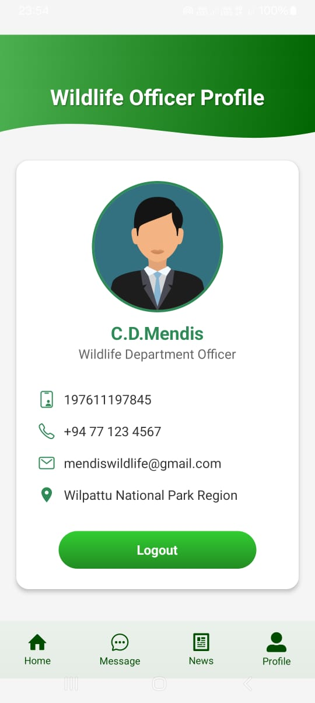

# SafeEle🐘 

## React Native Mobile App
### SafeEle is a mobile application designed to prevent elephant–train collisions by providing real-time elephant detection alerts, location tracking, and safety notifications to train drivers, station masters, wildlife officers, and the public. The app integrates with an IoT-based detection system that uses sensors and machine learning model  to identify elephants near railway tracks and instantly share  warnings to all engine drivers. SafeEle enhances railway safety, protects wildlife, and supports quick decision-making with accurate, timely information.

## Limitations of the existing system.
### ‣ Lack of a real-time detection system to monitor elephants near railway tracks.
### ‣ There is no system to warn the engine driver at the real  time.
### ‣ Lack of communication with engine driver, general people, wildlife department and station.
### ‣ Engine drivers haven’t idea about elephant crossings or high-risk zones.

## Functional Requirements
### ‣ The system should detect elephants near the railway tracks using sensor and camera. 
### ‣ Use machine learning model  to identify, detected object elephant or not.
### ‣ Engine drivers receive real-time alerts on elephant’s location. 
### ‣ The engine driver can view past collision zones and general people updated location. 
### ‣ The mobile app enables the engine driver to contact the stations. 
### ‣ General people can report elephant’s locations through a mobile app.
### ‣ The wildlife Department  can get information about the Elephant’s location and can add new collision data.
### ‣ The station can view the news sent by the driver, and they can also send important updates to the wildlife officers.

## 📸 App Screenshots

<table align="center">
  <tr>
    <th align="center">Home Page</th>
    <th width="100"></th>
    <th align="center">Login Page</th>
  </tr>
  <tr>
    <td align="center">
      
    </td>
    <td></td>
    <td align="center">
      
    </td>
  </tr>
</table>

<table align="center">
  <tr>
    <th align="center">Engine Driver Dashboard Page</th>
    <th width="100"></th>
    <th align="center">Real Time Detection </th>
  </tr>
  <tr>
    <td align="center">
      
    </td>
    <td></td>
    <td align="center">
      
    </td>
  </tr>
</table>

<table align="center">
  <tr>
    <th align="center">Past Collision Alert</th>
    <th width="100"></th>
    <th align="center">Send News to Station</th>
  </tr>
  <tr>
    <td align="center">
      
    </td>
    <td></td>
    <td align="center">
      
    </td>
  </tr>
</table>

<table align="center">
  <tr>
    <th align="center">Engine Driver Profile</th>
    <th width="100"></th>
    <th align="center">Station Dashboard</th>
  </tr>
  <tr>
    <td align="center">
      
    </td>
    <td></td>
    <td align="center">
      
    </td>
  </tr>
</table>

<table align="center">
  <tr>
    <th align="center">Send News to Wildlife Dep</th>
    <th width="100"></th>
    <th align="center">Station Profile </th>
  </tr>
  <tr>
    <td align="center">
      
    </td>
    <td></td>
    <td align="center">
      
    </td>
  </tr>
</table>

<table align="center">
  <tr>
    <th align="center">Wildlife Dashboard</th>
    <th width="100"></th>
    <th align="center">Past Elephant Collision</th>
  </tr>
  <tr>
    <td align="center">
      
    </td>
    <td></td>
    <td align="center">
      
    </td>
  </tr>
</table>

<table align="center">
  <tr>
    <th align="center">Past Elephant Collision Zones Analysze</th>
    <th width="100"></th>
    <th align="center">Guest Updated Locations</th>
  </tr>
  <tr>
    <td align="center">
      
    </td>
    <td></td>
    <td align="center">
      
    </td>
  </tr>
</table>

<table align="center">
  <tr>
    <th align="center">Guest Updated Location Analyze</th>
    <th width="100"></th>
    <th align="center">Add Vew Collision</th>
  </tr>
  <tr>
    <td align="center">
      
    </td>
    <td></td>
    <td align="center">
      
    </td>
  </tr>
</table>

<table align="center">
  <tr>
    <th align="center"> Wildlife Officer Profile</th>
    <th width="100"></th>
   
  </tr>
  <tr>
    <td align="center">
      
    </td>
    
  </tr>
</table>

