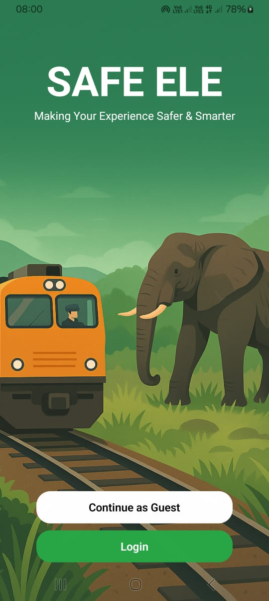
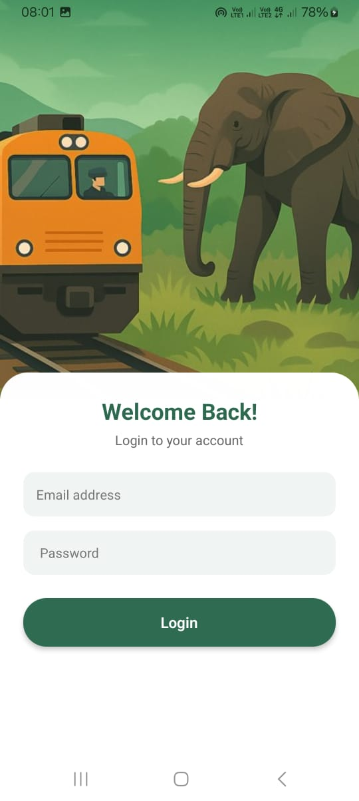

# SafeEle🐘 

## React Native Mobile App
### SafeEle is a mobile application designed to prevent elephant–train collisions by providing real-time elephant detection alerts, location tracking, and safety notifications to train drivers, station masters, wildlife officers, and the public. The app integrates with an IoT-based detection system that uses sensors and machine learning model  to identify elephants near railway tracks and instantly share  warnings to all engine drivers. SafeEle enhances railway safety, protects wildlife, and supports quick decision-making with accurate, timely information.

## 📸 App Screenshots

<table align="center">
  <tr>
    <th align="center">Home Page</th>
    <th width="100"></th>
    <th align="center">Login Page</th>
  </tr>
  <tr>
    <td align="center">
      
    </td>
    <td></td>
    <td align="center">
      
    </td>
  </tr>
</table>

<table align="center">
  <tr>
    <th align="center">Engine Driver Dashboard Page</th>
    <th width="100"></th>
    <th align="center"> Send New Page (Driver)</th>
  </tr>
  <tr>
    <td align="center">
      
    </td>
    <td></td>
    <td align="center">
      
    </td>
  </tr>
</table>

<table align="center">
  <tr>
    <th align="center">Past Collision Alert</th>
    <th width="100"></th>
    <th align="center">Engine Driver Profile</th>
  </tr>
  <tr>
    <td align="center">
      
    </td>
    <td></td>
    <td align="center">
      
    </td>
  </tr>
</table>

<table align="center">
  <tr>
    <th align="center"></th>
    <th width="100">Station Dashboard</th>
    <th align="center">Station Master Profile</th>
  </tr>
  <tr>
    <td align="center">
      
    </td>
    <td></td>
    <td align="center">
      
    </td>
  </tr>
</table>

<table align="center">
  <tr>
    <th align="center">wildlife dashboard</th>
    <th width="100"></th>
    <th align="center">Past Elephant Collision Zones </th>
  </tr>
  <tr>
    <td align="center">
      
    </td>
    <td></td>
    <td align="center">
      
    </td>
  </tr>
</table>

